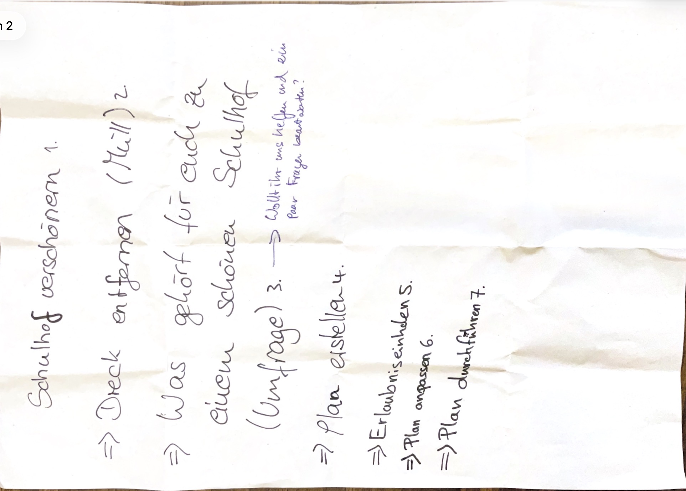

<!-- status: structured -->

# Bilddokumentation Pfandprojekt (Anhang A10)

> Die beiden Fotos werden hier für die Lesefassung um **90° im Uhrzeigersinn** gedreht dargestellt.

## Foto 1: Sammelbehälter mit Pfand-Hinweis

[Originaldatei öffnen](../../foto_pfandprojekt_sammelbehaelter_01.jpeg)

## Foto 2: Sammelbehälter im Schulkontext

[Originaldatei öffnen](../../foto_pfandprojekt_sammelbehaelter_02.jpeg)
